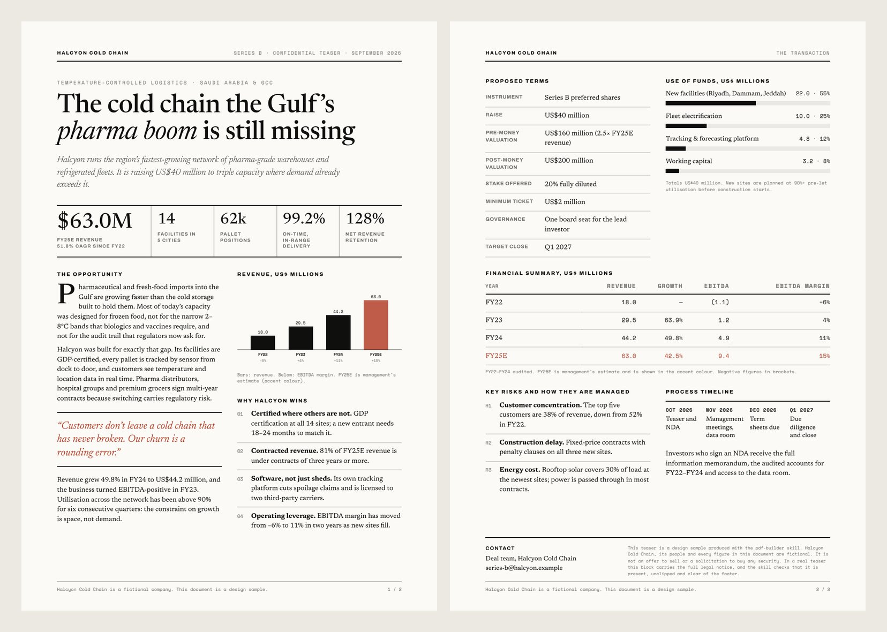
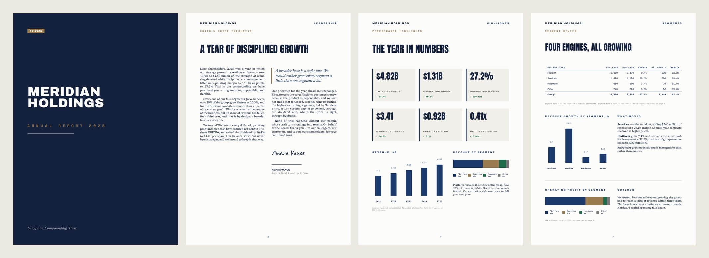
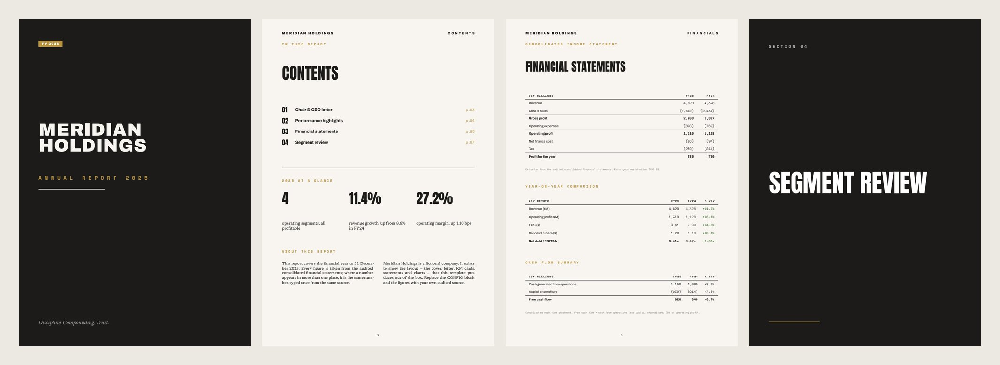
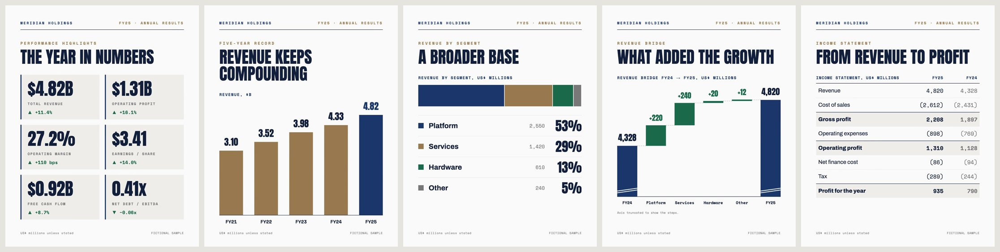
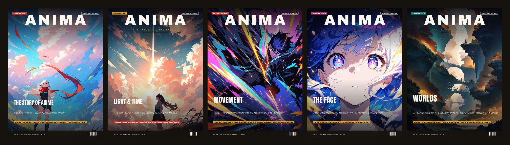
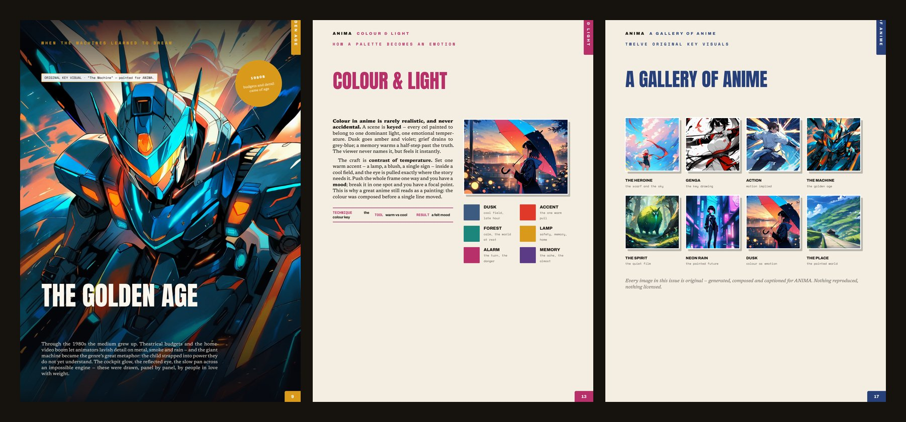
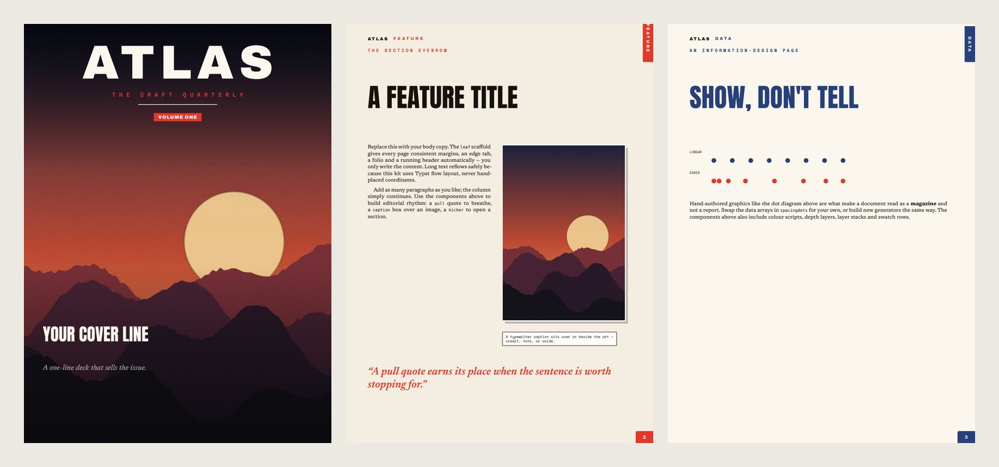

# Print Studio

**Skills that make Claude a print designer who also checks the maths.**

Three [Agent Skills](https://docs.claude.com/en/docs/agents-and-tools/agent-skills/overview) for print-ready PDFs (investor teasers, one-pagers, annual reports, full magazines) and for financial results as animated reels and interactive web reports. The documents look designed, not generated, and every number in them can be traced back to its source.

**Preview page:** [huggingface.co/spaces/Abukhalifa/print-studio](https://huggingface.co/spaces/Abukhalifa/print-studio) · **SkillMD:** [pdf-builder](https://skillmd.com/skills/hussainnasser1996/pdf-builder) · [magazine-builder](https://skillmd.com/skills/hussainnasser1996/magazine-builder) · finance-motion (in review)

| Skill | Engine | Best for |
|---|---|---|
| **`pdf-builder`** | HTML/CSS → headless Chrome / Edge | Investor teasers, one-pagers, term-sheet summaries, company profiles, short reports (1–20 pages) |
| **`magazine-builder`** | [Typst](https://typst.app) | Magazines, bookazines, lookbooks, **annual and financial reports**, anything long, multi-column or image-led |
| **`finance-motion`** | Typst + [Remotion](https://www.remotion.dev) + [ECharts](https://echarts.apache.org) | **One audited data file → a print PDF, an animated reel (LinkedIn 4:5 / 9:16) and an interactive web report**, with identical, machine-verified figures |


<sub>`pdf-builder`, *editorial-magazine* direction. A Series B teaser for a fictional company, produced by [`examples/investor-teaser/build.py`](examples/investor-teaser/build.py).</sub>

---

## Why these are different

Most document skills hand Claude a template and hope for the best. These start from what goes wrong with AI-made documents and guard against it:

- **Pick a design direction first.** Claude locks the typography, palette and composition before writing any layout, choosing from five named directions or extracting them from a reference PDF you like. No more "Inter + navy + teal" on every document.
- **Numbers come from one place.** Every figure has to trace back to a named source document, and conflicts between sources go to you rather than being quietly resolved. In the samples, the charts, tables and text all read from one data block, so they can't disagree.
- **Every page is read back after rendering.** Claude opens its own PDF and checks it: page count, text overprinting, footers, clipped legal text, contents-page numbers, and whether the totals add up. Hidden overflow, where `overflow:hidden` silently deletes a disclaimer, is checked by measurement, because you can't see it by eye.
- **New in 1.1: OCR read-back.** `scripts/readback_ocr.py` renders every page and reads the pixels with an open OCR model (GLM-OCR), then compares what a reader *sees* with what the file *contains*. It flags any figure that is in the PDF but invisible (white on white, covered, off the page), and any figure that is visible but can't be audited because it's baked into an image. It runs locally by default, and a built-in self-test proves the check can fail.
- **Flow layout, not guessed coordinates.** Text is never placed at fixed positions, so it can't collide with other text.

The annual-report sample shows why the read-back matters. Checking it against the skill's own rules caught a contents page pointing at the wrong pages, a growth rate off by 0.1 points, and a leverage change with the wrong sign. The template now reads its page numbers from the document, and it treats "good or bad" separately from "up or down".

## What it makes

### Annual reports (`magazine-builder`, annual-report mode)



<sub>One line (`DIRECTION = "luxury-refined"`) restyles the whole report. Meridian Holdings is fictional, but its figures add up: the segments sum to the group, the letter's claims match the tables, and every year-on-year % ties. PDFs are in [`examples/annual-report/`](examples/annual-report/).</sub>

### Financial results as print, reel and web (`finance-motion`)


<sub>Five held frames from a 35-second reel rendered from one `report.json`: count-up KPIs, growing revenue bars, the segment mix, a revenue waterfall and the income statement. The same file also renders a 3-page A4 PDF and a single-file interactive web report. No renderer is allowed to format a number: every visible figure is a `display` string from the data. `validate_report.py` refuses data that doesn't foot, and its self-test plants 7 errors and catches all 7. `verify_outputs.py` then reads every PDF page, held video frame and web section back with OCR, and confirms each figure is visible. Sample outputs are in [`examples/finance-motion/`](examples/finance-motion/): [reel](examples/finance-motion/meridian-reel.mp4) · [PDF](examples/finance-motion/meridian-report.pdf) · [web](examples/finance-motion/meridian-report.html) (download and open locally).</sub>

### Magazines and bookazines (`magazine-builder`)



<sub>*ANIMA* is a five-volume anime-craft bookazine by the author, built end to end with this skill. The key visuals are generated locally from original prompts, and the infographics are hand-built in Typst. Nothing is reproduced or licensed. (Preview images only; ANIMA itself is a commercial title.)</sub>


<sub>The starter template that ships with the skill, [`examples/magazine-starter/`](examples/magazine-starter/). It compiles as-is, including an original placeholder cover.</sub>

---

## Install

### Claude Code (plugin)

```text
/plugin marketplace add hussainnasser1996-stack/print-studio
/plugin install print-studio@print-studio
```

Then ask for what you want, e.g. *"Build a two-page investor teaser from these three files"* or *"Make a 7-page annual report from this Excel model"*. Claude loads the right skill on its own.

### Claude.ai or the Claude desktop app

Download `pdf-builder.zip` or `magazine-builder.zip` from the [Releases](https://github.com/hussainnasser1996-stack/print-studio/releases) page and upload it under **Settings → Capabilities → Skills**.

### Other agents (Cursor, Codex, Windsurf …)

Both skills follow the open `SKILL.md` format. Copy `plugins/print-studio/skills/<skill>/` into your agent's skills folder.

## Requirements

| | `pdf-builder` | `magazine-builder` |
|---|---|---|
| Renderer | Chrome (macOS), Edge (Windows) or Chromium (Linux), already on most machines | [Typst](https://github.com/typst/typst/releases), a single free binary. The skill has one-line installs for each OS |
| Read-back checks | `pip install pymupdf` | `pip install pypdfium2 pillow` |
| Fonts | Your choice, embedded as base64 | Bundled (all SIL OFL). A lite install can fetch them with `scripts/fetch_fonts.py` |
| OCR read-back (optional) | `pip install torch torchvision "transformers>=5.17" accelerate` | same |
| `finance-motion` | Typst (as above) · Node 18+ and `npm install` in `video/` for the reel (Remotion is free for individuals and companies of up to 3 people; larger companies need a [company licence](https://www.remotion.dev/license)) · a browser for the web report | |
| Optional | none | `diffusers` + an SDXL model for local, original illustrations; `gradio_client` for photo-real heroes via free Hugging Face Spaces |

## Repository layout

```text
plugins/print-studio/skills/
  pdf-builder/            SKILL.md · 5 aesthetic directions · reference-PDF mode
  magazine-builder/       SKILL.md · template.typ · annual_report.typ · image-generation scripts · fonts
  finance-motion/         SKILL.md · validate/verify scripts · pdf/ (Typst) · video/ (Remotion) · web/ (ECharts)
examples/
  investor-teaser/        build.py + template → 2-page PDF (fictional company)
  annual-report/          both design directions, 7 pages each (fictional company)
  magazine-starter/       the starter template, compiled
  finance-motion/         report.json → PDF + 35 s reel + interactive HTML (fictional company)
```

## Contributing

Issues and pull requests are welcome, especially new **aesthetic directions** for `pdf-builder`, new **info-design components** for `magazine-builder`, and bug reports that include the PDF that went wrong. Each fix to a skill should come with the failure that prompted it, since that's how the rules in these skills were written.

## Author

Built by **[Hussain Nasser](https://www.linkedin.com/in/hussain-nasser-8b3a4917b)**, who works in venture capital and fund operations in the GCC and builds AI tools for finance work. These skills came out of producing real investor documents, reports and a magazine series. If you want a report, teaser or publication built with them, get in touch on LinkedIn.

MIT licensed. See [LICENSE](LICENSE) for the font and ANIMA exceptions.
